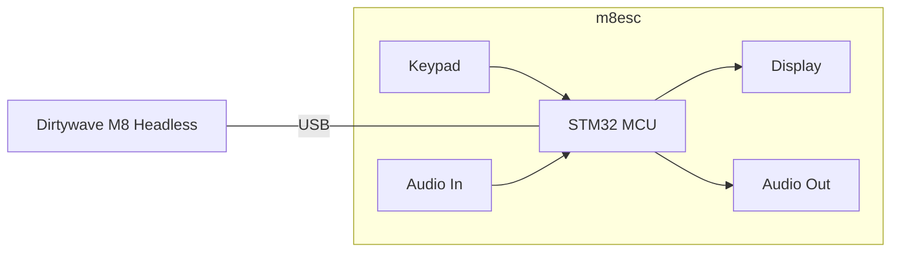

# m8ec

m8ec is a power-efficient and cost-efficient embedded peripheral system for the
[Headless Dirtywave M8](https://github.com/Dirtywave/M8HeadlessFirmware).
Currently, the project is in the prototype stage.

## Goal

Complement the Dirtywave M8 headless (Teensy 4.1) with a display, keypad, and an
audio interface that are similar to the original M8 hardware unit. The
peripherals may be driven by a microcontroller acting as a "client" (USB host in
fact) to the Teensy 4.1 running M8 headless firmware. The hardware peripherals
should be easily available and inexpensive.

Also, the goal is to have fun and learn something along the way.



## Development Environment Setup

This project was originally developed in WSL Ubuntu, and still is the primary
development environment.

1. Install these prerequisites:

    ```bash
    sudo apt update && sudo apt upgrade -y
    sudo apt install -y git cmake python3
    ```

2. Install Arm GNU Toolchain:

    > for more details see
    > [this](https://lindevs.com/install-arm-gnu-toolchain-on-ubuntu)  

    ```bash
    ARM_TOOLCHAIN_VERSION=$(curl -s https://developer.arm.com/downloads/-/arm-gnu-toolchain-downloads | grep -Po '<h4>Version \K.+(?=</h4>)')
    curl -Lo gcc-arm-none-eabi.tar.xz "https://developer.arm.com/-/media/Files/downloads/gnu/${ARM_TOOLCHAIN_VERSION}/binrel/arm-gnu-toolchain-${ARM_TOOLCHAIN_VERSION}-x86_64-arm-none-eabi.tar.xz"
    sudo mkdir /opt/gcc-arm-none-eabi
    sudo tar xf gcc-arm-none-eabi.tar.xz --strip-components=1 -C /opt/gcc-arm-none-eabi
    echo 'export PATH=$PATH:/opt/gcc-arm-none-eabi/bin' | sudo tee -a /etc/profile.d/gcc-arm-none-eabi.sh
    source /etc/profile
    arm-none-eabi-gcc --version
    arm-none-eabi-g++ --version
    arm-none-eabi-gdb --version
    rm -rf gcc-arm-none-eabi.tar.xz
    ```

    If getting `arm-none-eabi-gdb: error while loading shared libraries:
    libncursesw.so.5` error, install `libncurses5`:

    ```bash
    sudo apt install -y libncurses5
    ```

    If that does not help, try this:

    ```bash
    sudo apt install -y gdb-multiarch
    sudo mv /usr/bin/arm-none-eabi-gdb /usr/bin/arm-none-eabi-gdb.bak
    sudo ln -s /usr/bin/gdb-multiarch /usr/bin/arm-none-eabi-gdb
    ```

## Building the Firmware

1. Clone the project and its submodules:

    ```bash
    git clone https://github.com/lukasnee/m8ec.git
    git checkout prototype
    git submodule update --init --recursive
    ```

2. TODO: instruction for building and flashing the bootloader
   [bl_iram](extern/W25Q64_STM32H750VB-DevEBox/docs/bl_iram.md)
   for STM32H750 (DevEBox) platform.

3. Build using the project tool:

    ```bash
    python3 tools/m8ec.py -b
    ```

    > By default, it builds for `STM32H750` platform. Use `-p <PLATFORM>` to
    > specify different platform. For example
    > [STM32F411](docs/platform_STM32F411.md).

4. Build debug version:

    ```bash
    python3 tools/m8ec.py -b -t Debug
    ```

> Run `python3 tools/m8ec.py -h` to see more options.

## Flashing

The firmware variant is based on
[lukasnee/W25Q64_STM32H750VB-DevEBox](https://github.com/lukasnee/W25Q64_STM32H750VB-DevEBox.git)
project. It has a [bl_iram](extern//W25Q64_STM32H750VB-DevEBox/docs/bl_iram.md)
bootloader with a file system mounted on the external QSPI FLASH. The features a
communication protocol via serial for transferring application binary to the
device. The bootloader will then load the firmware to RAM and execute it.

The `tools/m8ec.py` has the bootloader communication protocol integrated, so the flashing is easy.

```bash
python3 tools/m8ec.py -f
```

> If using WSL, make sure to attach the ST-Link USB interface. There is a very
> convenient VSCode extension to do that effortlessly
> `thecreativedodo.usbip-connect`.

## Debugging

### Serial (printf)

1. Install `minicom`.

    ```bash
    sudo apt-get install -y minicom
    ```

2. Open a terminal using the project tool.

    ```bash
    python3 tools/m8ec.py --serial
    ```

### SEGGER SystemView + ST-Link as J-Link

> Here we use SystemView GUI for Windows, but it supports other OSes as well.

1. Build firmware with SEGGER SystemView enabled.

    ```bash
    python3 tools/m8ec.py -t Debug --sysview -b
    ```

2. Flash the firmware to the target MCU.

    ```bash
    python3 tools/m8ec.py -f
    ```

3. Install latest [SEGGER
   SystemView](https://www.segger.com/products/development-tools/systemview/)
   and J-Link drivers.
4. [STLinkReflash](https://www.segger.com/products/debug-probes/j-link/models/other-j-links/st-link-on-board/)
   tool can be used to reflash the ST-Link firmware to J-Link and back (ST-Link
   V2-1 only).

> In case [J-Link shown as generic BULK device in
> Windows](https://wiki.segger.com/J-Link_shown_as_generic_BULK_device_in_Windows).

5. Start SystemView and connect to the target MCU.

6. TBD...

## TODO

- Start with the hardware you have on hand:

  - Microcontroller: WeAct STM32F411CEU6 Black Pill.
  - Display: 2.8" TFT LCD (ILI9341) module. Keypad: Modified USB mechanical key
    number pad as GPIO input. Probably...
  - Audio out interface: PCM5102A module. Audio in the interface: PCM1802
    module.

- [ ] Figure out the USB client interface. Research what M8 Headless expects
  from the client.
  - <https://github.com/laamaa/m8c> could be very useful, although it's for
    Windows/Linux/MacOS.
- [ ] Get the USB client working with the Black Pill.
- [ ] Get the display working with the M8 headless via USB client.
- [ ] Modify the keypad to be driven by the Black Pill GPIO.
- [ ] Get The Keypad working with the Black Pill.
- [ ] Get the keypad working with the M8 headless via USB client.
- [ ] Hook up the audio-out interface to the Black Pill.
- [ ] Get the audio out working with the Black Pill.
- [ ] Get the audio out working with the M8 headless via USB client.
- [ ] Hook up the audio in the interface to the Black Pill.
- [ ] Get the audio in working with the Black Pill.
- [ ] Try to get the audio working with the M8 headless via a USB client. From
  reading online, it's tricky.

## Future Ideas

- [ ] MIDI in/out? If supported by the M8 headless.
- [ ] Eurorack System Integration? Maybe make a module out of it.

## Links

- Original Dirtywave M8: <https://dirtywave.com/products/m8-tracker>
- M8 Headless: <https://github.com/Dirtywave/M8HeadlessFirmware>
